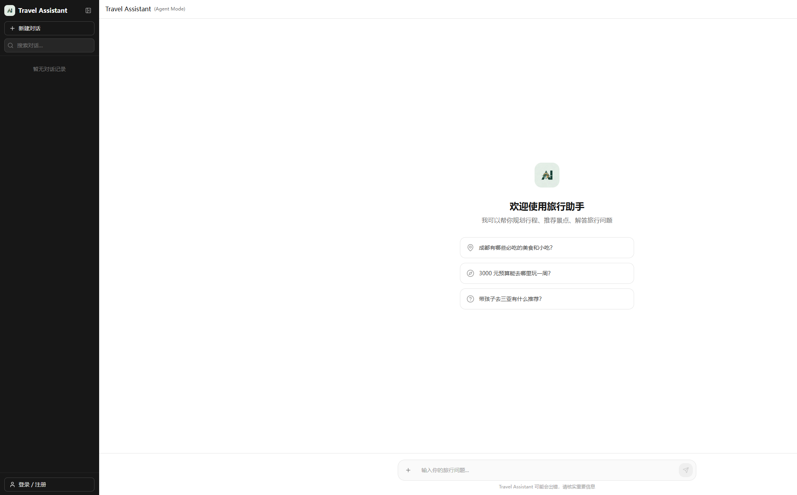

# 🧳 AI 旅行助手

<p align="center">
  
</p>

<p align="center">
  <strong>基于 LangChain.js + Next.js 的智能旅行规划助手</strong>
</p>

<p align="center">
  <a href="https://lang-chain-travel-agent.vercel.app/" target="_blank">🌐 在线演示</a> •
  <a href="https://github.com/wayde1122/langChain-travelAgent" target="_blank">📦 GitHub</a>
</p>

<p align="center">
  <a href="#功能特性">功能特性</a> •
  <a href="#技术栈">技术栈</a> •
  <a href="#快速开始">快速开始</a> •
  <a href="#项目结构">项目结构</a> •
  <a href="#贡献指南">贡献指南</a>
</p>

<p align="center">
  
  
  
  
  
</p>

---

## 📸 截图预览

<p align="center">
  
</p>

---

## ✨ 功能特性

- 🤖 **智能对话** - 基于大语言模型的多轮对话，流式输出实时响应
- 🛠️ **工具调用** - 集成高德地图（天气/POI）、飞常准（航班查询）等 MCP 服务
- 📚 **RAG 知识增强** - 内置 700+ 景点知识库，提供精准的旅行推荐
- 💾 **云端存储** - 基于 Supabase 的用户认证和会话持久化
- 📱 **响应式设计** - 完美适配桌面端和移动端

## 🏗️ 技术栈

| 类别       | 技术                                                                                                 |
| ---------- | ---------------------------------------------------------------------------------------------------- |
| 框架       | [Next.js 16](https://nextjs.org/) (App Router)                                                       |
| AI 框架    | [LangChain.js](https://js.langchain.com/) + [LangGraph](https://langchain-ai.github.io/langgraphjs/) |
| LLM        | [阿里云 DashScope](https://dashscope.aliyun.com/) (Qwen)                                             |
| 向量数据库 | [Supabase pgvector](https://supabase.com/docs/guides/database/extensions/pgvector)                   |
| 数据库     | [Supabase PostgreSQL](https://supabase.com/)                                                         |
| 状态管理   | [Zustand](https://zustand-demo.pmnd.rs/)                                                             |
| UI 组件    | [shadcn/ui](https://ui.shadcn.com/) + [Tailwind CSS](https://tailwindcss.com/)                       |
| 测试       | [Vitest](https://vitest.dev/) + [React Testing Library](https://testing-library.com/react)           |

## 🚀 快速开始

### 前置要求

- Node.js 18+
- npm 或 pnpm
- [Supabase](https://supabase.com/) 账户
- [阿里云 DashScope](https://dashscope.aliyun.com/) API Key

### 安装步骤

1. **克隆仓库**

```bash
git clone https://github.com/wayde1122/langChain-travelAgent.git
cd langChain-travelAgent
```

2. **安装依赖**

```bash
npm install
```

3. **配置环境变量**

复制 `.env.example` 为 `.env.local` 并填写配置：

```bash
cp .env.example .env.local
```

```env
# LLM 配置（阿里云 DashScope）
DASHSCOPE_API_KEY=your_dashscope_api_key
LLM_MODEL=qwen-plus
LLM_BASE_URL=https://dashscope.aliyuncs.com/compatible-mode/v1

# Supabase 配置
NEXT_PUBLIC_SUPABASE_URL=your_supabase_url
NEXT_PUBLIC_SUPABASE_ANON_KEY=your_supabase_anon_key
SUPABASE_SERVICE_ROLE_KEY=your_service_role_key  # 知识导入需要

# MCP 工具（可选）
AMAP_API_KEY=your_amap_api_key           # 高德地图
VARIFLIGHT_API_KEY=your_variflight_key   # 飞常准航班
```

4. **初始化数据库**

在 Supabase Dashboard 的 SQL Editor 中执行迁移脚本：

```bash
# 执行顺序
supabase/migrations/001_create_tables.sql        # 会话和消息表
supabase/migrations/002_create_knowledge_documents.sql  # 知识库表
```

5. **导入知识库**（可选）

```bash
# 模拟运行
npm run ingest:dry-run

# 正式导入
npm run ingest
```

6. **启动开发服务器**

```bash
npm run dev
```

访问 [http://localhost:3000](http://localhost:3000) 查看应用。

## 📁 项目结构

```
travel-assistant/
├── src/
│   ├── app/                    # Next.js App Router
│   │   ├── api/chat/           # 聊天 API
│   │   ├── auth/               # 认证页面
│   │   └── page.tsx            # 主页面
│   ├── components/             # React 组件
│   │   ├── ui/                 # shadcn/ui 组件
│   │   ├── chat/               # 聊天组件
│   │   └── auth/               # 认证组件
│   ├── lib/
│   │   ├── langchain/          # LangChain 配置
│   │   │   ├── agent.ts        # ReAct Agent
│   │   │   ├── rag/            # RAG 模块
│   │   │   └── tools/          # 本地工具
│   │   └── supabase/           # Supabase 客户端
│   ├── store/                  # Zustand Store
│   ├── services/               # 服务层
│   └── types/                  # TypeScript 类型
├── supabase/
│   └── migrations/             # 数据库迁移
├── scripts/                    # 工具脚本
└── openspec/                   # 功能规范文档
```

## 📜 可用脚本

| 命令                    | 描述                     |
| ----------------------- | ------------------------ |
| `npm run dev`           | 启动开发服务器           |
| `npm run build`         | 构建生产版本             |
| `npm run start`         | 启动生产服务器           |
| `npm run lint`          | ESLint 代码检查          |
| `npm run type-check`    | TypeScript 类型检查      |
| `npm run test`          | 运行测试                 |
| `npm run test:coverage` | 运行测试并生成覆盖率报告 |
| `npm run ingest`        | 导入知识库               |
| `npm run ingest:clear`  | 清空并重新导入知识库     |

## 🧪 测试

```bash
# 运行所有测试
npm run test

# 监视模式
npm run test -- --watch

# 覆盖率报告
npm run test:coverage
```

## 🔧 开发指南

### 代码规范

项目使用 ESLint + Prettier 进行代码规范检查，通过 Husky 在提交前自动执行。

```bash
# 手动运行 lint
npm run lint

# 自动修复
npm run lint:fix

# 格式化代码
npm run format
```

### 添加新工具

1. 在 `src/lib/langchain/tools/` 创建工具文件
2. 定义工具 Schema 和执行逻辑
3. 在 `agent.ts` 中注册工具

### 更新知识库

1. 编辑 `src/data/knowledge/knowledge.jsonl`
2. 运行 `npm run ingest:clear` 重新导入

## 🗺️ 开发路线图

- [✅] 阶段 1：基础对话
- [✅] 阶段 2：流式输出
- [✅] 阶段 3：工具调用（MCP 集成）
- [✅] 阶段 4：用户认证和会话持久化
- [✅] 阶段 5：RAG 知识增强

详见 [ROADMAP.md](./ROADMAP.md)

## 🤝 贡献指南

欢迎贡献！请遵循以下步骤：

1. Fork 本仓库
2. 创建特性分支 (`git checkout -b feature/amazing-feature`)
3. 提交更改 (`git commit -m 'Add some amazing feature'`)
4. 推送到分支 (`git push origin feature/amazing-feature`)
5. 开启 Pull Request

### 提交规范

使用 [Conventional Commits](https://www.conventionalcommits.org/) 规范：

- `feat:` 新功能
- `fix:` Bug 修复
- `docs:` 文档更新
- `style:` 代码格式（不影响功能）
- `refactor:` 重构
- `test:` 测试相关
- `chore:` 构建/工具相关

## 📄 许可证

本项目基于 [MIT 许可证](./LICENSE) 开源。

## 🙏 致谢

- [LangChain.js](https://js.langchain.com/) - 强大的 LLM 应用框架
- [Next.js](https://nextjs.org/) - React 全栈框架
- [Supabase](https://supabase.com/) - 开源 Firebase 替代方案
- [shadcn/ui](https://ui.shadcn.com/) - 精美的 UI 组件库
- [阿里云 DashScope](https://dashscope.aliyun.com/) - 通义千问大模型服务

---

<p align="center">
  Made with  by <a href="https://github.com/wayde1122">wayde1122</a>
</p>
